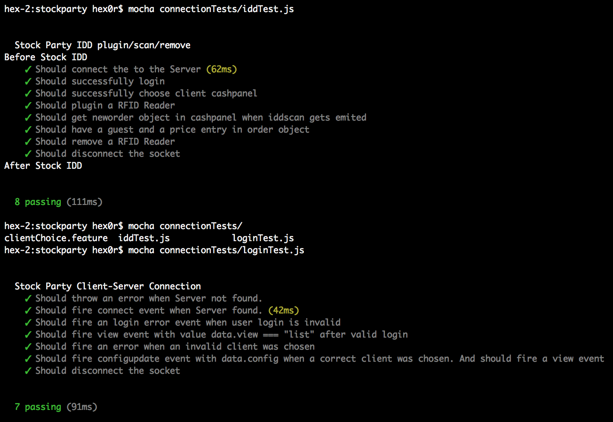
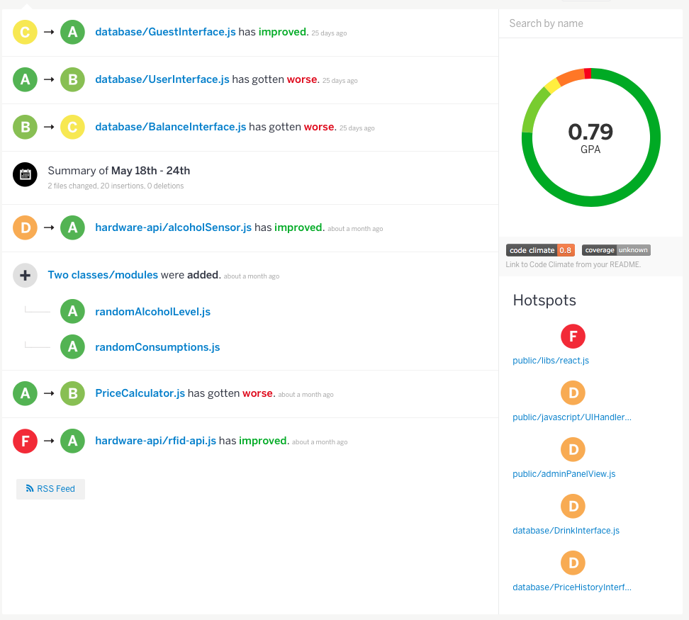

# Stock Party Software #
## RUP Test Plan ##

*Version 1.6*

## Revision History ##
Check this file's history directly on Github.     
[RUP Revision History](https://github.com/unverschaemt/stockparty-projektmanagement/commits/master/rup.md)

## Table of Contents ##
1. Introduction
2. Evaluation Mission and Test
3. Architectural Goal and Constraints
4. Outline of Planned Tests
5. Test Approach
6. Deliverables

#1. Introduction   

## Intended Audience
* Students  
* Professors
* Open-source enthusiasts  
  
## Document Terminology and Acronyms

#2. Evaluation Mission and Test Motivation
Within todays fast and changing environment one will probably fail without automated tests. Weird error messages lead to unsatisfied customers. Still errors will occur, because you will never be able to cover them all. But the main goal with this approach is to cover more than 80% of all methods as well as keep them tested, because often errors happen to channel into your code with later commits.
    
This leads to a broken project and is often hard to resolve since you probably don't even know why.
  
## Background
We've chosen to use Mocha since it fits best into our project, but it's quite hard to keep an accurate test coverage, since we're using a special and customized design pattern.    
Also there's a lot of UI-specific code that is hardly testable in general since it can differ a lot in different browsers.
  
## Evaluation Mission
**What we except from our tests**
* keep calculating algorithms (most important core) working correctly
* eliminate later bug occurence
* quality standards
* fast coverage overview
* automatisation
* faster & smoother development

## Motivation
* quality risks
* technical risks
* project risks
* use cases
* functional requirements
* non-functional requirements
* suspected failures

# Approach
All tests can be executed seperately as well as automated with a build tool or continuous integration. Results are optionally sent to our HipChat conversation room or developers mailing list.

## Testing Technique
As mentioned above we keep our code base tested with automated Mocha tests. Those run through all specified use cases and calls each method on the one hand with valid input to validate those methods work as desired and on the other hand with invalid input to also cover error handling and possible system crashes. 

#### Resources
Each test case comes with a `.feature` file that formally describes the test case in human readable format.     

They are mostly functional and descriptive with clear demand.

# Deliverables
### Mocha
  

### Code Climate
  